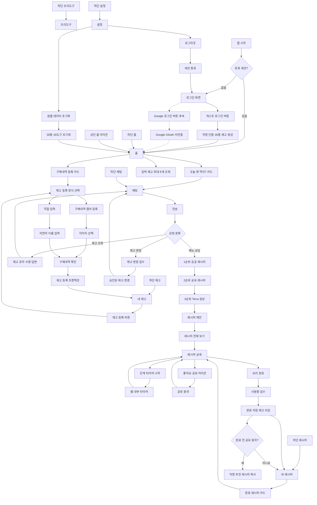
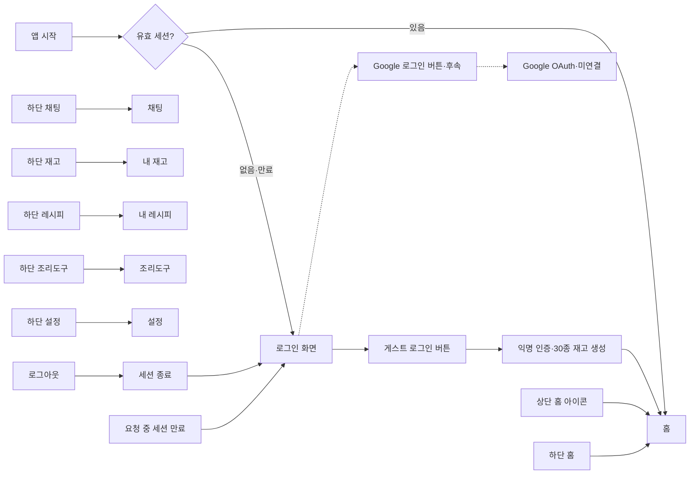
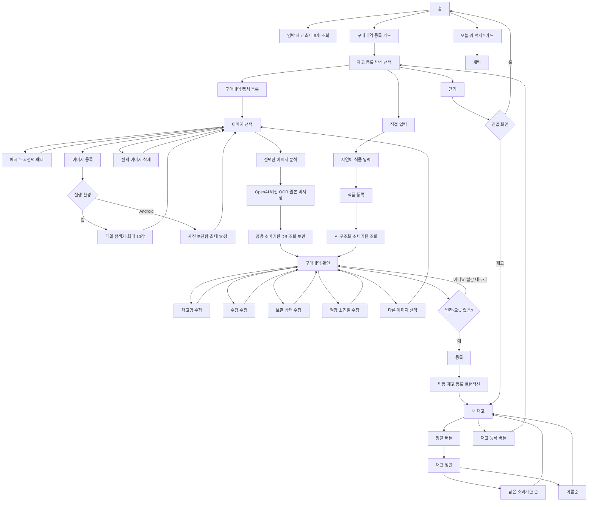
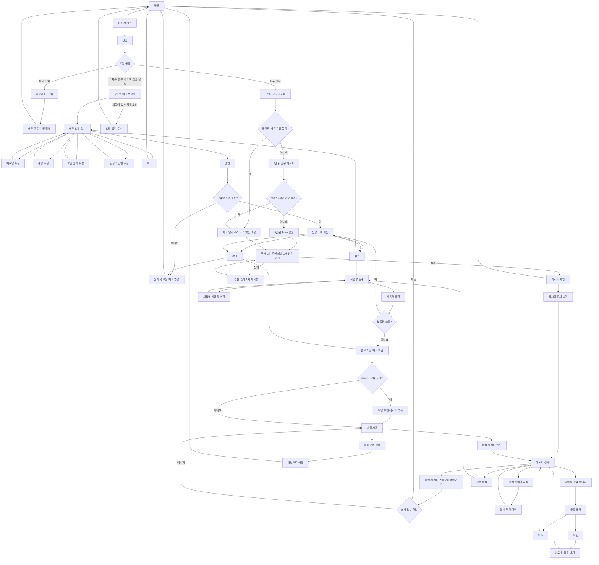
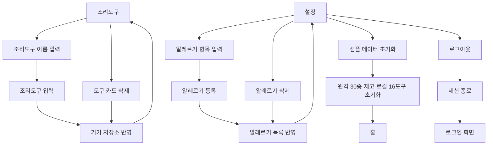

# 냉톡 사용자 흐름

- 기준일: 2026-09-27
- 범위: 현재 심사용 웹과 공용 Expo 클라이언트
- 표기: 실선은 현재 구현, 점선은 아직 출시되지 않은 경로다.

이 문서는 버튼 하나가 여는 화면과 데이터를 바꾸기 전 사용자가 거치는 확인 단계를 추적한다. 여러 화면에서 같은 곳으로 이동하면 별도 복제 없이 같은 노드로 합친다.

## 1. 전체 서비스 맵

## 2. 로그인·공통 이동

- 게스트 로그인 뒤에는 온보딩이 없고 바로 홈으로 간다.
- 세션은 재실행 때 복원되며 사용자가 설정에서 로그아웃할 때 종료된다.
- Google 로그인 UI는 있지만 production OAuth는 아직 연결하지 않았다.
- 상단 홈 아이콘과 하단 홈 버튼은 모두 같은 `HomeScreen`으로 합쳐진다.

## 3. 홈·재고 등록·정렬

## 4. 채팅·레시피·요리 완료

### 레시피 검색 불변 조건

1. 공공 레시피 → 공유 레시피 → Terra 생성 순서를 건너뛰지 않는다.
2. 보유 재료만으로 가능한 구매 0개 후보가 항상 우선이다.
3. 구매 필요 품목이 2개 이상인 결과는 사용자에게 보여주지 않는다.
4. 알레르기·고위험 가열·실제 재고 수량 검증을 통과한 결과만 상세 화면으로 보낸다.
5. 좋아요는 공유 의사만 저장한다. `요리 완료` 트랜잭션이 성공하기 전에는 공유 DB에 복사하지 않는다.

## 5. 조리도구·설정

## 6. 데이터가 바뀌는 지점

| 변경 지점 | 사용자 확인 | 서버·저장소 결과 |
| --- | --- | --- |
| 구매내역/직접 입력 등록 | 검수 행의 이름·수량·보관·날짜 확인 후 `등록` | 원격 재고 lot과 이벤트를 멱등 저장 |
| 채팅 재고 변경 | 편집 가능한 변경안에서 `승인`; 초과 소비는 전량 소비를 한 번 더 확인 | 사용자 소유 lot만 원자적으로 변경 |
| 요리 완료 | 재료별 사용량 수정 후 `사용량 확정`; 초과 소비 재확인 | 완료 레시피 저장과 재고 차감을 같은 트랜잭션으로 처리 |
| AI 레시피 공유 | 좋아요 팝업 `확인` 후 실제로 `요리 완료` | 개인 완료 레시피가 존재할 때만 익명 공유 사본 생성 |
| 샘플 초기화 | 설정의 명시적 버튼 | 게스트 재고 30종과 조리도구 16종을 초기 상태로 복원 |
| 로그아웃 | 설정의 명시적 버튼 | 인증 세션 종료 후 로그인 화면 이동 |

AI 응답만으로는 재고가 바뀌지 않는다. 모든 재고 쓰기는 편집 가능한 검수 또는 요리 완료 확인 뒤에 실행한다.
