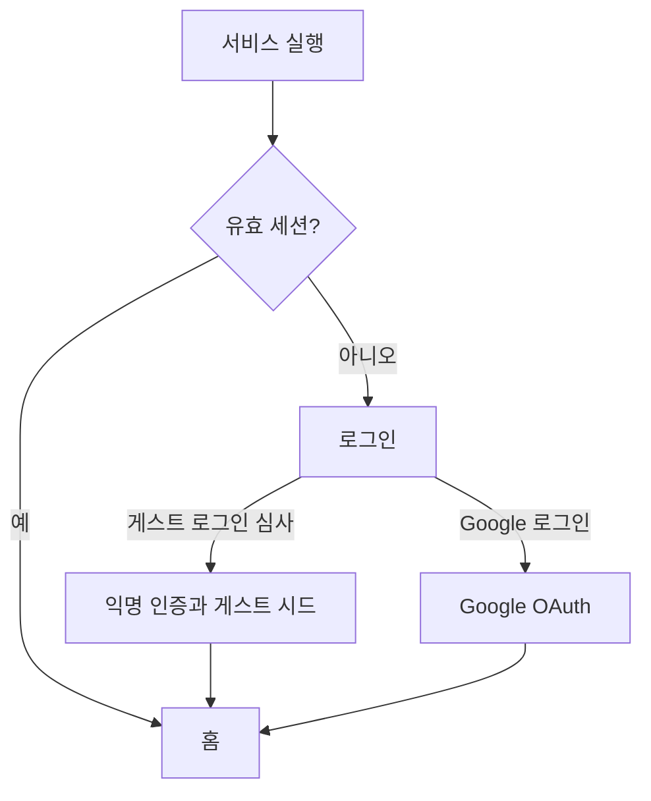

# 냉톡 코드 리팩터링·문서·Supabase 감사 Implementation Plan

> **For agentic workers:** REQUIRED SUB-SKILL: Use superpowers:subagent-driven-development (recommended) or superpowers:executing-plans to implement this plan task-by-task. Steps use checkbox (`- [ ]`) syntax for tracking.

**Goal:** 승인된 UI와 서비스 동작을 유지하면서 미사용 Expo 잔재를 제거하고, `NaengTalk.tsx`를 기능별 모듈로 분리하며, Supabase와 제품 문서를 현재 상태에 맞게 검증·정리한다.

**Architecture:** `NaengTalk.tsx`는 인증·최상위 상태·원격 재조회·화면 조합만 담당하는 컨테이너로 유지한다. 화면과 모달은 데이터와 callback을 props로 받는 표현 컴포넌트로 분리하고 `services`를 직접 호출하지 않는다. Android 빌드·권한·저장소·EAS Update 기반은 보존하고 제품과 무관한 Expo 데모 코드만 제거한다.

**Tech Stack:** Expo 55, React Native 0.83, React 19, TypeScript 5.9, Supabase Auth/Postgres/Edge Functions, Node test runner, Mermaid

**Spec:** `docs/superpowers/specs/2026-09-27-code-refactor-documentation-audit-design.md`

## Global Constraints

- production UI 구조·문구·색상·상호작용을 변경하지 않는다.
- 기존 Supabase migration·테이블·인덱스·사용자 데이터를 삭제하거나 수정하지 않는다.
- `expo-router`, Safe Area, SecureStore, ImagePicker, EAS Update와 Android adaptive icon·splash 기반을 보존한다.
- 화면·모달 컴포넌트는 Supabase 또는 Edge Function을 직접 호출하지 않는다.
- API key, service role, DB password와 개인정보를 출력·문서화·커밋하지 않는다.
- production 배포와 GitHub push는 별도 사용자 지시 전까지 실행하지 않는다.

## Review Focus

- `.web.tsx` platform resolution과 Android native module 구성이 파일 이동 후에도 같은 구현을 선택해야 한다. Task 2·7의 TypeScript, Expo config, export 검사로 고정한다.
- 모달 취소·닫기·완료 시 임시 상태가 이전과 동일하게 초기화되어야 한다. Task 5의 소스 계약 테스트와 전체 회귀 테스트로 고정한다.
- 화면 추출 후 callback이 오래된 `state`를 캡처하거나 재고를 중복 반영하면 안 된다. Task 4·5에서 컨테이너가 기존 handler를 그대로 전달하고 도메인 테스트를 재실행한다.
- Android를 위해 보존한 패키지와 설정이 단순 미사용 검사로 삭제되지 않아야 한다. Task 1의 보존 계약 테스트와 Task 2의 dependency 검사로 고정한다.
- 원격 스모크 테스트는 기존 사용자를 건드리지 않고 익명 게스트에서 한 번씩만 실행해야 한다. Task 7에서 별도 게스트와 bounded 호출을 사용한다.

---

### Task 1: 리팩터링 경계와 Android 보존 계약 고정

**Files:**
- Create: `tests/refactor-boundaries.test.ts`
- Modify: `tests/ui-contract.test.ts`
- Modify: `tests/recipe-sharing.test.ts`

**Interfaces:**
- Consumes: 현재 `mobile/src/features/NaengTalk.tsx`, `mobile/package.json`, `mobile/app.json`
- Produces: 파일 분리 후에도 UI 문자열과 Android 기반을 검사하는 `readFeatureSources(): string`

- [ ] **Step 1: 분리된 기능 소스를 함께 읽는 helper와 실패 테스트 작성**

```ts
import { readdirSync, readFileSync } from 'node:fs';
import { join } from 'node:path';

function readTree(path: string): string {
  return readdirSync(path, { withFileTypes: true })
    .flatMap((entry) => entry.isDirectory()
      ? [readTree(join(path, entry.name))]
      : /\.(ts|tsx)$/.test(entry.name)
        ? [readFileSync(join(path, entry.name), 'utf8')]
        : [])
    .join('\n');
}
```

`ui-contract.test.ts`와 `recipe-sharing.test.ts`가 단일 `NaengTalk.tsx` 대신 `mobile/src/features/naengtalk/`까지 함께 읽도록 바꾸고, 새 테스트에는 다음 계약을 추가한다.

```ts
test('android foundations remain while expo demo files are absent', () => {
  const pkg = JSON.parse(readFileSync(packagePath, 'utf8'));
  const app = JSON.parse(readFileSync(appJsonPath, 'utf8')).expo;
  assert.equal(pkg.dependencies['expo-secure-store'], '^55.0.18');
  assert.equal(pkg.dependencies['expo-image-picker'], '~55.0.24');
  assert.equal(pkg.dependencies['expo-updates'], '~55.0.30');
  assert.equal(app.android.runtimeVersion.policy, 'appVersion');
  assert.ok(app.android.adaptiveIcon.foregroundImage);
  assert.equal(existsSync(deadWebBadgePath), false);
  assert.equal(existsSync(deadR2Path), false);
});
```

- [ ] **Step 2: 새 테스트가 현재 잔재 때문에 실패하는지 확인**

Run: `node --test tests/refactor-boundaries.test.ts tests/ui-contract.test.ts tests/recipe-sharing.test.ts`

Expected: `web-badge.tsx`와 `r2.jpg`가 존재해 새 경계 테스트만 FAIL하고 기존 UI·공유 계약은 PASS.

- [ ] **Step 3: 테스트 helper 경로와 assertion을 실제 저장소 구조에 맞게 확정**

`new URL('../mobile/src/features', import.meta.url)`에서 재귀적으로 소스를 읽고, 숨김 파일·자산은 포함하지 않는다. `NaengTalk.tsx`와 새 하위 폴더를 중복 읽지 않도록 한 번만 순회한다.

- [ ] **Step 4: 테스트 파일 자체의 TypeScript 실행 확인**

Run: `node --test tests/refactor-boundaries.test.ts tests/ui-contract.test.ts tests/recipe-sharing.test.ts`

Expected: 의도된 잔재 assertion 외의 구문·경로 오류 없음.

- [ ] **Step 5: 커밋**

```bash
git add tests/refactor-boundaries.test.ts tests/ui-contract.test.ts tests/recipe-sharing.test.ts
git commit -m "test: define refactor and android boundaries"
```

### Task 2: 검증된 Expo 템플릿 잔재 제거

**Files:**
- Delete: `mobile/src/components/animated-icon.module.css`
- Delete: `mobile/src/components/animated-icon.tsx`
- Delete: `mobile/src/components/animated-icon.web.tsx`
- Delete: `mobile/src/components/external-link.tsx`
- Delete: `mobile/src/components/hint-row.tsx`
- Delete: `mobile/src/components/themed-text.tsx`
- Delete: `mobile/src/components/themed-view.tsx`
- Delete: `mobile/src/components/web-badge.tsx`
- Delete: `mobile/src/components/ui/collapsible.tsx`
- Delete: `mobile/src/hooks/use-theme.ts`
- Delete: `mobile/src/hooks/use-color-scheme.ts`
- Delete: `mobile/src/hooks/use-color-scheme.web.ts`
- Delete: `mobile/src/constants/theme.ts`
- Delete: `mobile/src/styles.d.ts`
- Delete: `mobile/scripts/reset-project.js`
- Delete: `mobile/assets/demo/purchases/r2.jpg`
- Delete: `mobile/assets/images/expo-badge.png`
- Delete: `mobile/assets/images/expo-badge-white.png`
- Delete: `mobile/assets/images/expo-logo.png`
- Delete: `mobile/assets/images/logo-glow.png`
- Delete: `mobile/assets/images/react-logo.png`
- Delete: `mobile/assets/images/react-logo@2x.png`
- Delete: `mobile/assets/images/react-logo@3x.png`
- Delete: `mobile/assets/images/tutorial-web.png`
- Delete: `mobile/assets/images/tabIcons/explore.png`
- Delete: `mobile/assets/images/tabIcons/explore@2x.png`
- Delete: `mobile/assets/images/tabIcons/explore@3x.png`
- Delete: `mobile/assets/images/tabIcons/home.png`
- Delete: `mobile/assets/images/tabIcons/home@2x.png`
- Delete: `mobile/assets/images/tabIcons/home@3x.png`
- Modify: `mobile/package.json`
- Modify: `mobile/src/features/NaengTalk.tsx`

**Interfaces:**
- Consumes: Task 1의 삭제·Android 보존 계약
- Produces: 제품 코드와 Android 기반만 남은 클라이언트 트리

- [ ] **Step 1: 최종 참조 검색**

Run:

```powershell
rg -n "animated-icon|ExternalLink|HintRow|WebBadge|Collapsible|ThemedText|ThemedView|useTheme|useColorScheme|r2\.jpg|reset-project" mobile tests
```

Expected: 삭제 후보끼리의 내부 참조와 `package.json`·템플릿 README 참조만 존재. 제품 진입점 참조는 0건.

- [ ] **Step 2: 템플릿 파일과 자산 삭제**

위 Files 목록의 삭제 대상만 제거한다. 다음은 직접 참조가 없어도 유지한다.

- `mobile/assets/expo.icon/**`
- `mobile/assets/fonts/LICENSE-SUIT.txt`
- `mobile/assets/images/icon.png`
- `mobile/assets/images/android-icon-background.png`
- `mobile/assets/images/android-icon-monochrome.png`
- `mobile/assets/images/splash-icon.png`
- `mobile/assets/images/refrigerator-handle.png`

- [ ] **Step 3: 초기화 스크립트와 미사용 import 정리**

`mobile/package.json`에서 `reset-project` script만 제거한다. `NaengTalk.tsx`의 `getAndroidWebFrame` import를 제거한다. Expo Router가 의존하는 navigation·reanimated·worklets 패키지와 Android 기반 패키지는 이번 작업에서 제거하지 않는다.

- [ ] **Step 4: 경계 테스트와 엄격 TypeScript 검사**

Run:

```powershell
node --test tests/refactor-boundaries.test.ts
cd mobile
.\node_modules\.bin\tsc.cmd --noEmit --noUnusedLocals --noUnusedParameters
```

Expected: PASS, unused declaration 0건.

- [ ] **Step 5: Expo dependency 구성 확인**

Run: `npx expo install --check`

Expected: 현재 Expo SDK와 설치 버전 불일치 없음. 패키지 자동 수정은 하지 않는다.

- [ ] **Step 6: 커밋**

```bash
git add mobile tests/refactor-boundaries.test.ts
git commit -m "refactor: remove unused expo starter code"
```

### Task 3: 최상위 모델과 공통 UI 컴포넌트 추출

**Files:**
- Create: `mobile/src/features/naengtalk/model.ts`
- Create: `mobile/src/features/naengtalk/sample-recipe.ts`
- Create: `mobile/src/features/naengtalk/components/app-button.tsx`
- Create: `mobile/src/features/naengtalk/components/refrigerator-handle.tsx`
- Create: `mobile/src/features/naengtalk/components/app-header.tsx`
- Create: `mobile/src/features/naengtalk/components/bottom-navigation.tsx`
- Modify: `mobile/src/features/NaengTalk.tsx`
- Modify: `tests/refactor-boundaries.test.ts`

**Interfaces:**
- Produces: `AppTab`, `LocalState`, `createInitialState()`, `sampleRecipe`, `AppButton`, `RefrigeratorHandle`, `AppHeader`, `BottomNavigation`
- Consumes: 기존 `MenuRecipe`, `CookingState`, `ChatMessage`, `createGuestInventory`, `createGuestTools`, `backendConfig`, `theme.ts`

- [ ] **Step 1: 새 모듈 경계에 대한 실패 테스트 작성**

```ts
test('shared naengtalk modules own model and navigation chrome', () => {
  assert.equal(existsSync(modelPath), true);
  assert.equal(existsSync(buttonPath), true);
  assert.equal(existsSync(headerPath), true);
  assert.equal(existsSync(navigationPath), true);
  assert.match(containerSource, /createInitialState/);
  assert.match(containerSource, /<BottomNavigation/);
});
```

- [ ] **Step 2: 테스트 실패 확인**

Run: `node --test tests/refactor-boundaries.test.ts`

Expected: 새 파일이 없어 FAIL.

- [ ] **Step 3: 모델과 샘플 데이터 이동**

`model.ts`에 다음 공개 계약을 정의한다.

```ts
export type AppTab = 0 | 1 | 2 | 3 | 4 | 5;
export type LocalState = CookingState & {
  providedAt: string;
  saved: boolean;
  savedRecipeId: string | null;
  sharePending: boolean;
  shared: boolean;
  tools: string[];
  allergens: string[];
  timer: { label: string; endsAt: number } | null;
  chat: ChatMessage[];
  recipe: MenuRecipe | null;
};
export function createInitialState(now = new Date()): LocalState;
```

기존 `fresh()`의 반환값과 날짜 형식을 그대로 유지한다. `sample-recipe.ts`에는 현재 `sampleSteps`와 `sampleRecipe`를 값 변경 없이 이동한다.

- [ ] **Step 4: 공통 컴포넌트 이동**

`AppButton`은 다음 props를 유지한다.

```ts
export type AppButtonProps = {
  children: string;
  onPress: () => void;
  secondary?: boolean;
  loading?: boolean;
  disabled?: boolean;
};
```

`AppHeader`는 탭 번호, 제목, 홈 이동 callback, scale 값을 받고 기존 홈 아이콘·캐치프레이즈·구분선 JSX를 그대로 렌더링한다. `BottomNavigation`은 `tab`, `onSelect(tab)`, `scale`만 받아 기존 여섯 탭과 접근성 상태를 렌더링한다.

- [ ] **Step 5: 컨테이너에서 새 모듈 사용**

기존 상수·함수·중복 JSX를 제거하고 새 모듈을 import한다. 상태 초기화는 `useState<LocalState>(createInitialState)`로 유지한다.

- [ ] **Step 6: 관련 계약과 전체 테스트 실행**

Run:

```powershell
node --test tests/refactor-boundaries.test.ts tests/ui-contract.test.ts tests/home-layout.test.ts tests/typography.test.ts
cd mobile
.\node_modules\.bin\tsc.cmd --noEmit --noUnusedLocals --noUnusedParameters
```

Expected: PASS.

- [ ] **Step 7: 커밋**

```bash
git add mobile/src/features tests
git commit -m "refactor: extract app model and shared chrome"
```

### Task 4: 여섯 탭 화면을 표현 컴포넌트로 분리

**Files:**
- Create: `mobile/src/features/naengtalk/screens/login-screen.tsx`
- Create: `mobile/src/features/naengtalk/screens/home-screen.tsx`
- Create: `mobile/src/features/naengtalk/screens/chat-screen.tsx`
- Create: `mobile/src/features/naengtalk/screens/inventory-screen.tsx`
- Create: `mobile/src/features/naengtalk/screens/recipes-screen.tsx`
- Create: `mobile/src/features/naengtalk/screens/tools-screen.tsx`
- Create: `mobile/src/features/naengtalk/screens/settings-screen.tsx`
- Modify: `mobile/src/features/NaengTalk.tsx`
- Modify: `tests/refactor-boundaries.test.ts`
- Modify: `tests/ui-contract.test.ts`

**Interfaces:**
- Consumes: `LocalState`, 기존 handler, `theme.ts`, 현재 layout 계산값
- Produces: 서비스 import가 없는 화면 컴포넌트 7개

- [ ] **Step 1: 화면 모듈 경계 실패 테스트 작성**

```ts
test('screens are presentational and never import services', () => {
  for (const source of screenSources) {
    assert.doesNotMatch(source, /from ['"].*\/services\//);
    assert.doesNotMatch(source, /supabase/i);
  }
  assert.match(containerSource, /<HomeScreen/);
  assert.match(containerSource, /<ChatScreen/);
  assert.match(containerSource, /<SettingsScreen/);
});
```

- [ ] **Step 2: 테스트 실패 확인**

Run: `node --test tests/refactor-boundaries.test.ts`

Expected: 화면 파일이 없어 FAIL.

- [ ] **Step 3: 로그인·홈·채팅 화면 추출**

각 화면은 현재 JSX를 그대로 이동한다. callback 이름을 다음처럼 고정한다.

```ts
LoginScreen: onGuestLogin, onGoogleLogin, busy
HomeScreen: onOpenRegistration, onOpenChat
ChatScreen: onSend, onOpenRecipe, onInputFocus, onInputBlur
```

채팅의 `ScrollView`, 입력값, `aiBusy`, 작성 행 레이아웃과 keyboard focus callback은 그대로 props로 전달한다.

- [ ] **Step 4: 재고·레시피·조리도구·설정 화면 추출**

```ts
InventoryScreen: inventory, sortMode, onOpenSort, onOpenRegistration
RecipesScreen: savedRecipe, providedAt, onOpenRecipe
ToolsScreen: tools, input, onChangeInput, onAddTool, onRemoveTool
SettingsScreen: allergens, allergenInput, onChangeAllergenInput, onAddAllergen, onRemoveAllergen, onResetDemo, onLogout
```

실제 기존 state setter를 쓰는 경우 컨테이너에서 같은 동작의 callback을 만들어 전달한다. 화면 파일은 `setState` 또는 `setTab`을 직접 소유하지 않는다.

- [ ] **Step 5: 컨테이너에서 탭별 화면 조합**

`tab === N` 조건은 컨테이너에 남겨 현재 mount/unmount 시점을 유지한다. 각 화면에 기존 memo 값과 handler를 전달하고, 서비스 호출 handler의 본문은 이동하지 않는다.

- [ ] **Step 6: 화면·레이아웃 회귀 테스트**

Run:

```powershell
node --test tests/ui-contract.test.ts tests/home-layout.test.ts tests/inventory-presentation.test.ts tests/menu-chat.test.ts tests/menu-chat-inventory.test.ts tests/typography.test.ts tests/web-frame.test.ts
cd mobile
.\node_modules\.bin\tsc.cmd --noEmit --noUnusedLocals --noUnusedParameters
```

Expected: PASS.

- [ ] **Step 7: 커밋**

```bash
git add mobile/src/features tests
git commit -m "refactor: split naengtalk tab screens"
```

### Task 5: 구매·요리·재고 검수 모달 분리

**Files:**
- Create: `mobile/src/features/naengtalk/modals/chat-inventory-review-modal.tsx`
- Create: `mobile/src/features/naengtalk/modals/recipe-detail-modal.tsx`
- Create: `mobile/src/features/naengtalk/modals/overdraw-confirm-modal.tsx`
- Create: `mobile/src/features/naengtalk/modals/share-consent-modal.tsx`
- Create: `mobile/src/features/naengtalk/modals/inventory-sort-modal.tsx`
- Create: `mobile/src/features/naengtalk/modals/purchase-registration-modal.tsx`
- Modify: `mobile/src/features/NaengTalk.tsx`
- Modify: `tests/refactor-boundaries.test.ts`
- Modify: `tests/ui-contract.test.ts`
- Modify: `tests/recipe-sharing.test.ts`

**Interfaces:**
- Consumes: 기존 review row·usage draft·purchase selection 타입과 컨테이너 handler
- Produces: 서비스 import가 없고 close/confirm callback이 명시된 모달 컴포넌트 6개

- [ ] **Step 1: 모달 경계와 callback 계약 실패 테스트 작성**

```ts
test('modal modules do not call remote services', () => {
  for (const source of modalSources) {
    assert.doesNotMatch(source, /from ['"].*\/services\//);
  }
  assert.match(purchaseModalSource, /onClose/);
  assert.match(purchaseModalSource, /onAnalyze/);
  assert.match(purchaseModalSource, /onRegister/);
  assert.match(recipeModalSource, /onFinishCooking/);
  assert.match(recipeModalSource, /onConfirmShare/);
});
```

- [ ] **Step 2: 테스트 실패 확인**

Run: `node --test tests/refactor-boundaries.test.ts`

Expected: 모달 파일이 없어 FAIL.

- [ ] **Step 3: 작은 확인 모달부터 이동**

`OverdrawConfirmModal`, `ShareConsentModal`, `InventorySortModal`을 먼저 이동한다. visible·onCancel·onConfirm·현재 표시 값만 props로 전달한다. 취소 시 기존 setter가 실행되는 시점과 오류 초기화 순서를 유지한다.

- [ ] **Step 4: 채팅 재고 검수 모달 이동**

행 수정 callback은 `onChangeRow(id, patch)` 형태로 전달하고, 승인 handler는 컨테이너의 `confirmChatInventory()`를 그대로 호출한다. 초과 사용 확인은 기존 `overdraw` 상태를 통해 `OverdrawConfirmModal`로 이어진다.

- [ ] **Step 5: 레시피 상세·사용량 모달 이동**

타이머 시작, 사용량 편집, 목록/채팅 복귀, 공유 동의, 요리 완료 callback을 props로 분리한다. `finish()`, `confirmShare()`, `startUsageReview()`의 본문과 호출 순서는 컨테이너에 유지한다.

- [ ] **Step 6: 구매 등록 모달 이동**

샘플 선택, 직접 이미지 선택, 분석, 부분 실패, 직접 입력, 검수 행 수정, 최종 등록, 닫기 callback을 props로 전달한다. `closeRegistration()`이 초기화하는 상태 목록을 변경하지 않는다.

- [ ] **Step 7: 모달·재고·공유 회귀 테스트**

Run:

```powershell
node --test tests/purchase-review.test.ts tests/purchase-ocr.test.ts tests/chat-inventory.test.ts tests/cooking.test.ts tests/usage-review.test.ts tests/recipe-sharing.test.ts tests/ui-contract.test.ts tests/refactor-boundaries.test.ts
cd mobile
.\node_modules\.bin\tsc.cmd --noEmit --noUnusedLocals --noUnusedParameters
```

Expected: PASS.

- [ ] **Step 8: 컨테이너 책임 확인**

`NaengTalk.tsx`에 남는 것은 state/ref, layout 계산, effect, service handler, 화면·모달 조합이어야 한다. 화면별 대형 JSX 블록과 `Modal` 태그는 남지 않아야 한다.

- [ ] **Step 9: 커밋**

```bash
git add mobile/src/features tests
git commit -m "refactor: split review and cooking modals"
```

### Task 6: 제품 기획·README·TODO·전체 유저 플로우 갱신

**Files:**
- Create: `docs/USER_FLOW.md`
- Modify: `docs/PRODUCT_PLAN.md`
- Modify: `README.md`
- Modify: `mobile/README.md`
- Modify: `TODO.md`
- Modify: `HUMAN-IN-THE-ROOF.md`
- Modify: `docs/PRD.md`
- Modify: `docs/TRD.md`
- Modify: `docs/PRODUCT_DECISIONS.md`
- Create: `tests/documentation-current.test.ts`

**Interfaces:**
- Consumes: 현재 구현·배포 상태와 Task 2~5의 최종 파일 구조
- Produces: 외부 사용자용 최신 서비스 설명과 버튼 단위 Mermaid 유저 플로우

- [ ] **Step 1: 오래된 기획 문구를 고정하는 실패 테스트 작성**

```ts
test('product docs describe the implemented guest and OCR architecture', () => {
  assert.match(productPlan, /30종/);
  assert.match(productPlan, /Android·웹 공통 OpenAI 비전/);
  assert.doesNotMatch(productPlan, /게스트 기본 재고: 두부·달걀.*10종/);
  assert.doesNotMatch(productPlan, /Android OCR은 온디바이스/);
  assert.match(readme, /docs\/USER_FLOW\.md/);
});
```

- [ ] **Step 2: 테스트 실패 확인**

Run: `node --test tests/documentation-current.test.ts`

Expected: 과거 10종·온디바이스 OCR 문구와 유저 플로우 링크 부재로 FAIL.

- [ ] **Step 3: 서비스 기획서 현재화**

`docs/PRODUCT_PLAN.md`의 기준일과 다음 내용을 실제 상태로 수정한다.

- 30종 게스트 재고와 16종 조리도구
- Android·웹 공통 OpenAI 비전 OCR
- 공공 카탈로그 → 완료·동의 공유 레시피 → Terra 생성
- 구현 완료 기능과 Google OAuth·Android APK·알림 등 대기 기능의 명시적 구분
- production 웹 주소와 현재 배포 상태

아직 구현되지 않은 조리 세션 복구·푸시 알림을 현재 제공 기능처럼 표현하지 않는다.

- [ ] **Step 4: 전체 유저 플로우 작성**

`docs/USER_FLOW.md`에 다음 Mermaid subgraph와 고유 노드를 작성한다.



이후 하나의 master map에 6개 탭, 홈 카드, 공통 홈 버튼, 구매 등록·직접 입력·OCR 검수, 채팅 재고 변경, 레시피 검색 분기, 상세·타이머·요리 완료·공유, 설정·알레르기·초기화·로그아웃을 모두 연결한다. 기능별 상세도에서도 master와 동일한 노드 ID·명칭을 사용한다.

- [ ] **Step 5: README와 모바일 안내 정리**

최상위 README는 외부인을 위한 서비스 소개·현재 구현 상태·실행·검증·문서 인덱스를 유지하고 `PRODUCT_PLAN.md`, `PRD.md`, `TRD.md`, `USER_FLOW.md` 링크를 추가한다. `mobile/README.md`의 Expo 예제 안내와 reset script 설명을 제거하고 아래 명령만 남긴다.

```bash
pnpm install
pnpm web
pnpm android
pnpm exec tsc --noEmit
```

- [ ] **Step 6: TODO·결정·사용자 개입 기록 동기화**

`TODO.md`는 기준일을 갱신하고 완료된 UI 항목을 다음 순서에서 제거하며, 실제 남은 출시 항목을 Google OAuth·최종 OCR/소진일 QA·Android APK·제출 검수로 정리한다. `HUMAN-IN-THE-ROOF.md`에는 현재 디자인 유지, 선택적 모듈화, Android 보존 기준을 한 행으로 기록한다. PRD/TRD/PRODUCT_DECISIONS에서는 과거 10종·온디바이스 OCR·웹 레시피 검색처럼 현재 결정과 충돌하는 문장만 수정한다.

- [ ] **Step 7: Mermaid와 문서 계약 검증**

Run:

```powershell
node --test tests/documentation-current.test.ts
npx -y @mermaid-js/mermaid-cli -i docs/USER_FLOW.md -o $env:TEMP\naengtalk-user-flow.svg
```

Expected: 문서 테스트 PASS. Mermaid CLI가 모든 fenced Mermaid block을 파싱하거나, CLI가 Markdown 다중 블록을 지원하지 않으면 각 block을 임시 `.mmd`로 추출해 모두 exit 0.

- [ ] **Step 8: 커밋**

```bash
git add README.md mobile/README.md TODO.md HUMAN-IN-THE-ROOF.md docs tests/documentation-current.test.ts
git commit -m "docs: align product plan and user flows"
```

### Task 7: Supabase 감사와 전체 기능 검증

**Files:**
- Create: `docs/SUPABASE_AUDIT.md`
- Modify: `docs/TRD.md`
- Modify: `TODO.md`
- Modify: `HUMAN-IN-THE-ROOF.md`

**Interfaces:**
- Consumes: linked project `ygdbvbjvnnoxyjeidnnj`, 기존 remote smoke scripts, 모든 변경 사항
- Produces: 비밀정보 없는 재현 가능한 DB 감사 기록과 최종 검증 결과

- [ ] **Step 1: 전체 로컬 회귀 테스트**

Run: `node --test tests/*.test.ts`

Expected: 168개 기존 테스트와 새 경계·문서 테스트 모두 PASS, fail 0.

- [ ] **Step 2: TypeScript와 Expo 설정 검사**

Run:

```powershell
cd mobile
.\node_modules\.bin\tsc.cmd --noEmit --noUnusedLocals --noUnusedParameters
npx expo install --check
npx expo config --type public
```

Expected: exit 0. 공개 config 출력에 secret 없음.

- [ ] **Step 3: 웹 정적 export**

Run: `npx expo export --platform web --clear --output-dir dist-refactor-check`

Expected: export exit 0, `dist-refactor-check/index.html`과 JS bundle 생성. 생성물은 커밋하지 않는다.

- [ ] **Step 4: Supabase migration·schema·function 감사**

Run:

```powershell
npx supabase migration list --linked
npx supabase db lint --linked --level warning
npx supabase functions list --project-ref ygdbvbjvnnoxyjeidnnj
npx supabase inspect db table-stats --linked
```

Expected:

- local/remote migration 23개 일치
- DB lint result 0
- `menu-chat`, `purchase-ocr`, `inventory-parse` ACTIVE 및 `verify_jwt=true`
- catalog rows 1,684 / 18,920 / 9,542
- shelf-life source rows 116, active rules 136 전후의 합리적 범위

- [ ] **Step 5: 원격 익명 게스트·재고·소비기한 스모크**

Run:

```powershell
node tests/remote-guest-seed-smoke.mjs
node tests/remote-shelf-life-smoke.mjs
node tests/remote-chat-inventory-smoke.mjs
```

Expected: 새 익명 게스트의 30종 시드, 공용 소비기한 hit/miss 계약, 승인된 채팅 재고 변경과 사용자 격리가 PASS.

- [ ] **Step 6: 원격 메뉴·레시피·요리 완료 스모크**

Run:

```powershell
node tests/remote-menu-chat-smoke.mjs
node tests/remote-recipe-smoke.mjs
node mobile/scripts/verify-guest-reset.mjs
```

Expected: 재고 조회 질문은 레시피를 생성하지 않고, 메뉴 요청은 구매 0개 우선·최대 1개 계약을 지키며, 초기화 후 재고가 원격 30종과 일치. 요리 완료는 기존 자동 테스트의 RPC 원자성·멱등성 계약과 함께 확인한다.

- [ ] **Step 7: 로컬 브라우저 시각 회귀 확인**

`pnpm web`을 실행하고 다음을 390×844와 작은 224×498 viewport에서 확인한다.

- 로그인 화면과 게스트 진입
- 홈 세 카드와 6개 하단 탭
- 각 탭 상단바·홈 복귀
- 구매 등록·직접 입력·정렬·레시피 상세·초과 사용·공유 모달
- 채팅 작성 행과 모바일 keyboard 축소 모사

Expected: 구조·문구·카드 비율·모달 행동이 production 기준과 동일하고 브라우저 콘솔 오류 0건.

- [ ] **Step 8: 감사 문서와 상태 기록**

`docs/SUPABASE_AUDIT.md`에 실행 날짜, 명령, migration 수, 함수 버전, 테이블 개수, lint 결과, 제거하지 않은 저사용 인덱스 판단을 기록한다. secret·JWT·DB password는 기록하지 않는다. `docs/TRD.md`, `TODO.md`, `HUMAN-IN-THE-ROOF.md`에 최종 검증 결과와 남은 차단 요소를 반영한다.

- [ ] **Step 9: 변경 자체 점검**

Run:

```powershell
git diff --check
git status --short
git diff --stat HEAD~6..HEAD
```

Expected: whitespace 오류 0건, `.env.local`, secret, export 산출물 미추적.

- [ ] **Step 10: 최종 커밋**

```bash
git add docs/SUPABASE_AUDIT.md docs/TRD.md TODO.md HUMAN-IN-THE-ROOF.md
git commit -m "docs: record supabase and release verification"
```

## Plan Self-Review

- Spec coverage: 미사용 코드 제거, Android 보존, 선택적 모듈화, DB 감사, 기획서·README·TODO·HITL 갱신, 전체 유저 플로우, 최종 테스트가 모두 Task 1~7에 연결돼 있다.
- Placeholder scan: `TBD`, 구현 위임형 문장, 미정 함수명 없음.
- Type consistency: `LocalState`, `AppTab`, `createInitialState`, 화면·모달 callback 이름을 각 task에서 동일하게 사용한다.
- Review Focus coverage: platform resolution, 모달 초기화, stale state, Android 기반 보존, 원격 격리 테스트가 각각 Task 1·2·4·5·7에 검증 단계로 포함돼 있다.
